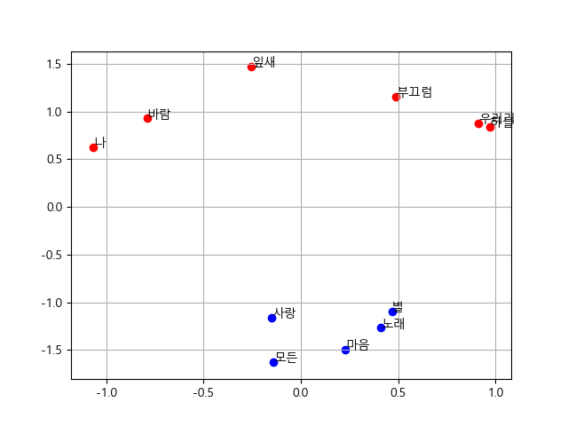
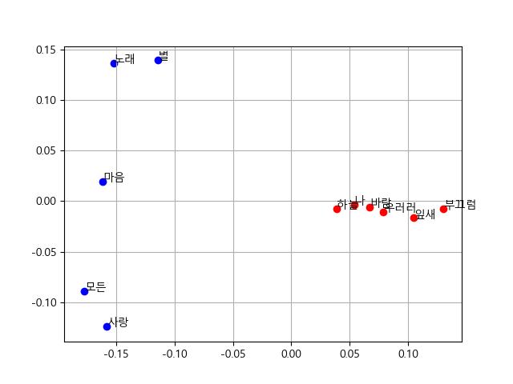

# NLP-with-tensorflow-pytorch
All about NLP

### Paper
*Paper* |*Name* | *Author* | *Years*
:---: | :---: | :---: | :---:
[arxiv](https://arxiv.org/abs/1301.3781) | Efficient Estimation of Word Representations in Vector Space | Sam Abrahams, Danijar Hafner, Erik Erwitt, Ariel Scarpinelli | 2016
[arxiv](https://arxiv.org/abs/1810.08854) | pair2vec: Compositional Word-Pair Embeddings for Cross-Sentence Inference| Mandar Joshi et al. | 2018

#### Random generation
All results are randomly sampled.

 *Skip-Gram* | *CBOW* | *Pair2Vec*
 :---: | :---: | :---: |
 |  | 
