## Objective

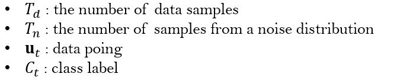

*Paper Link* | *Version* | *Objective*
:---: | :---: | :---: |
**[NCE](https://dl.acm.org/citation.cfm?id=2188396)** | basic_skip_gram_v1.py | 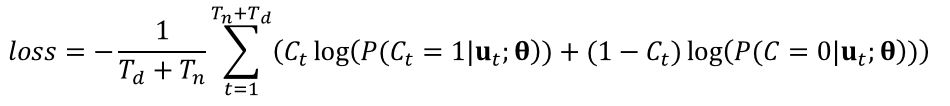

## Prologue by Dong-Ju Yun 
 *Skip-gram_v1* | *Skip-gram_v2* |
 :---: | :---: | 
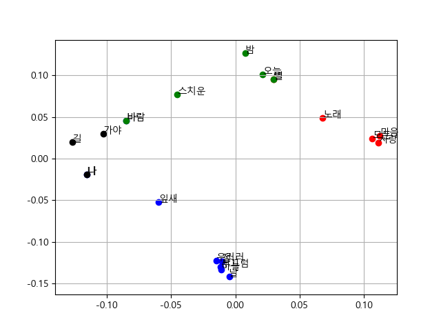 | 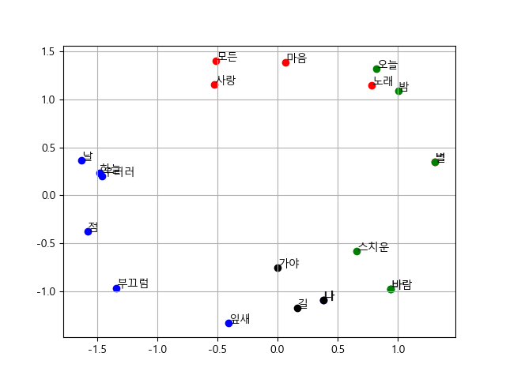 |

### Skip-gram v1

*Epoch 5* | *Epoch 10* | *Epoch 20*
:---: | :---: | :---: |
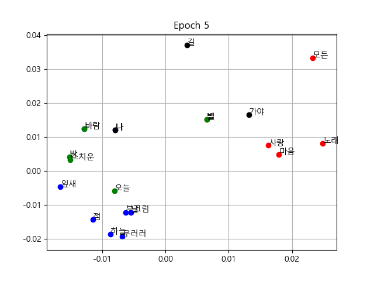 | 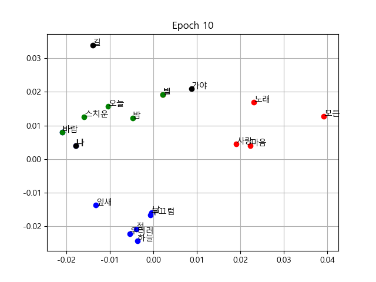 | 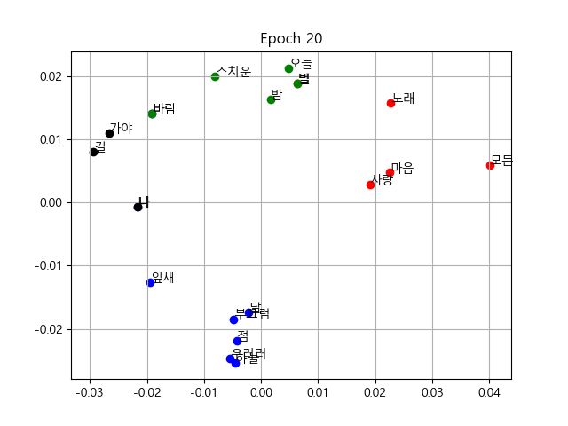

## PPT

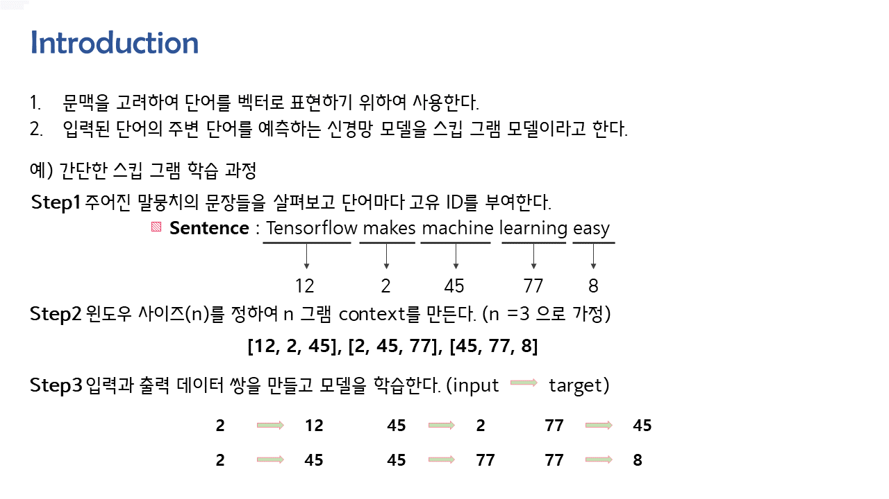

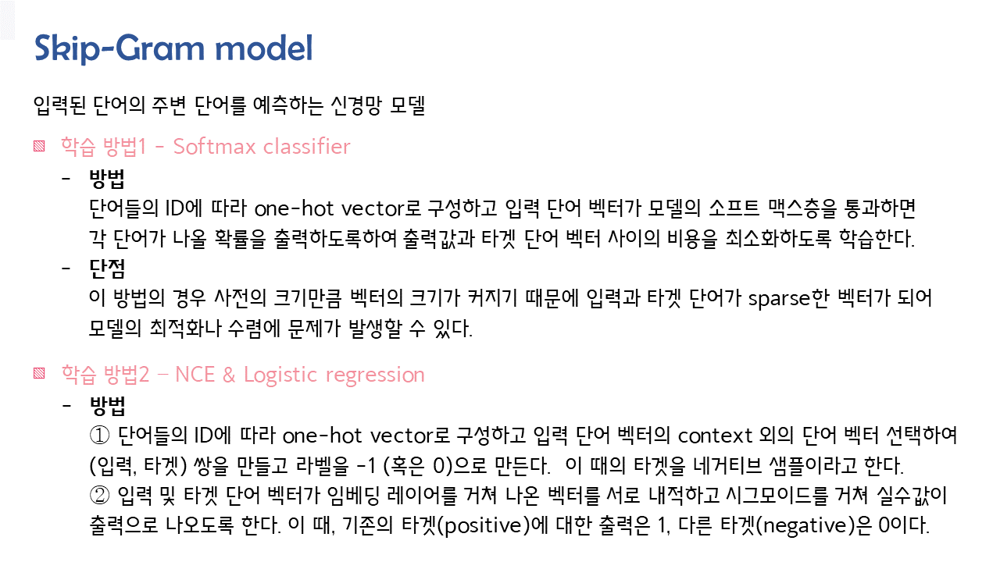

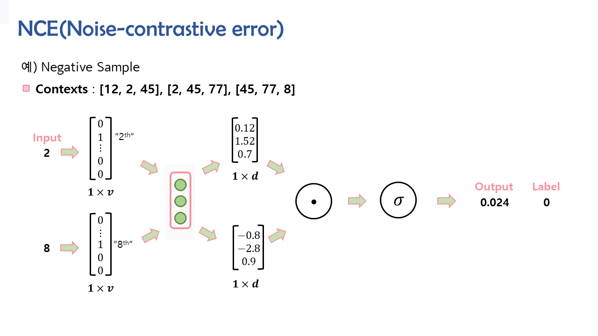

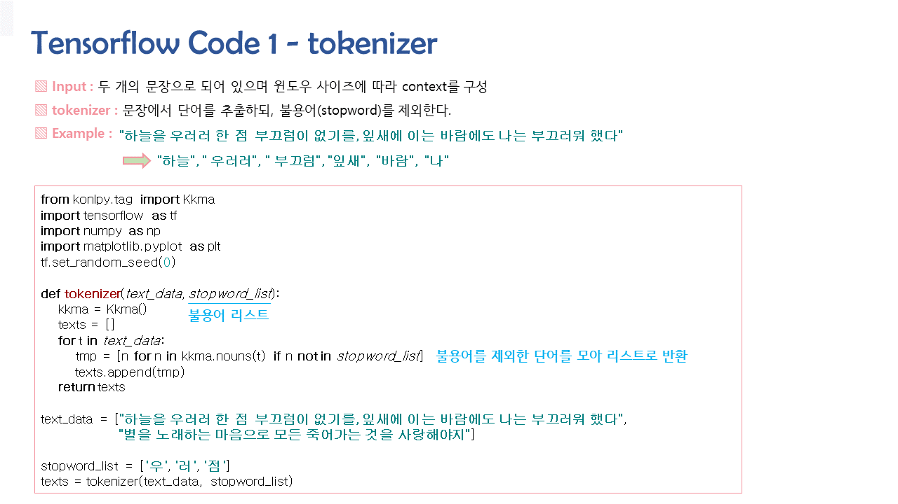

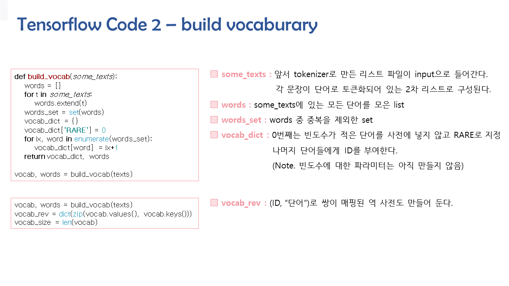

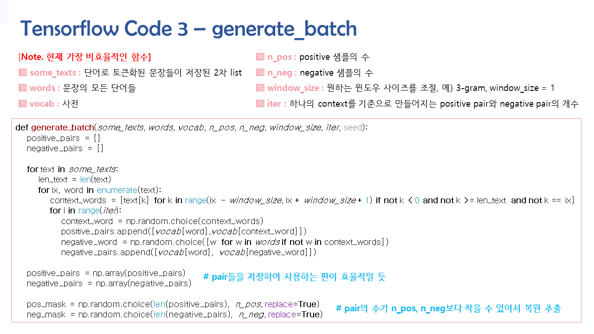

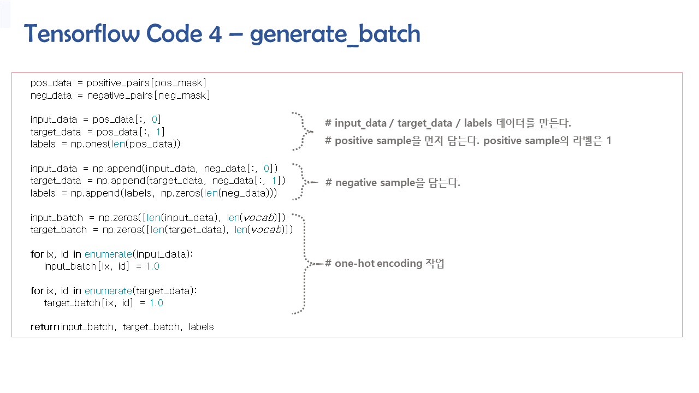

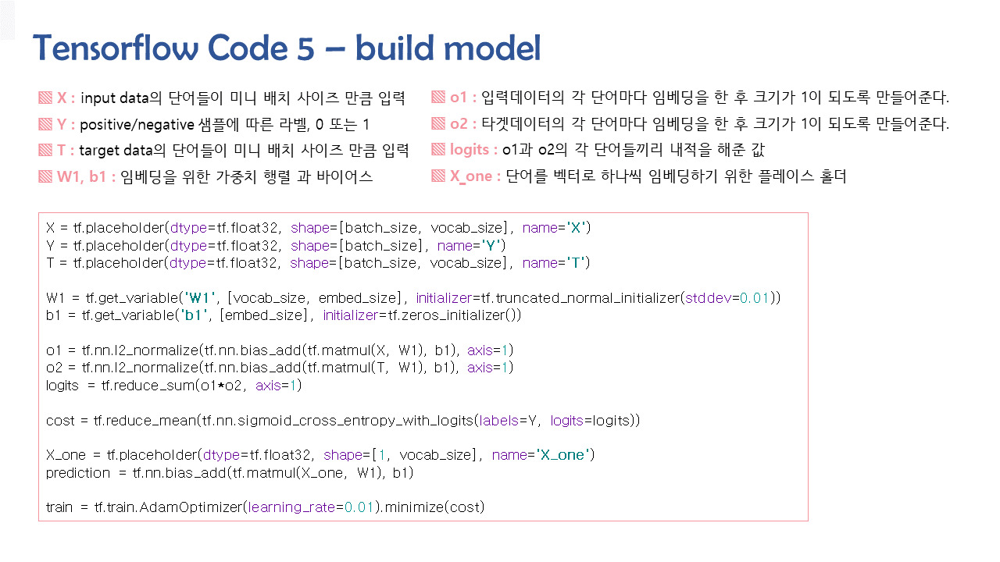

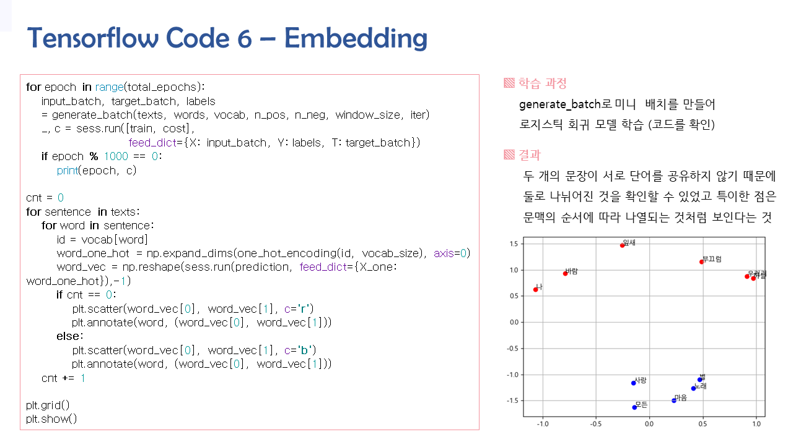

