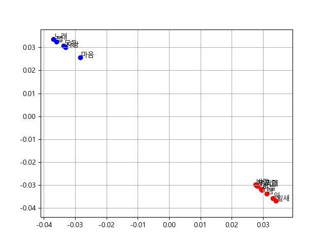
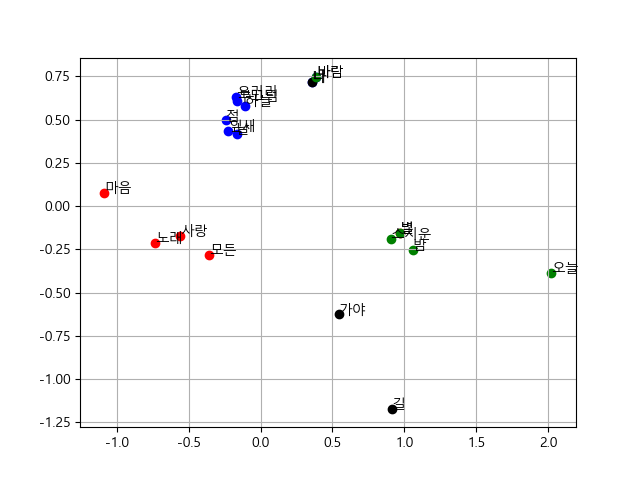

# Pair2Vec Tutorial

*Author: Gyeong-Hoon Lee ([Github](https://github.com/ghlee0304))*

*Reference paper : pair2vec: Compositional Word-Pair Embeddings for Cross-Sentence Inference [[arxiv](https://arxiv.org/abs/1810.08854)]*

- [Introduction](#introduction)
# Introduction

# Version
- v1 : SGD with 2 Sentences

- v2 : mini batch SGD with 4 Sentences

## Prologue by Dong-Ju Yun 
 *pair2vec_v1* | *pair2vec_v2* |
 :---: | :---: | 
 |  |
